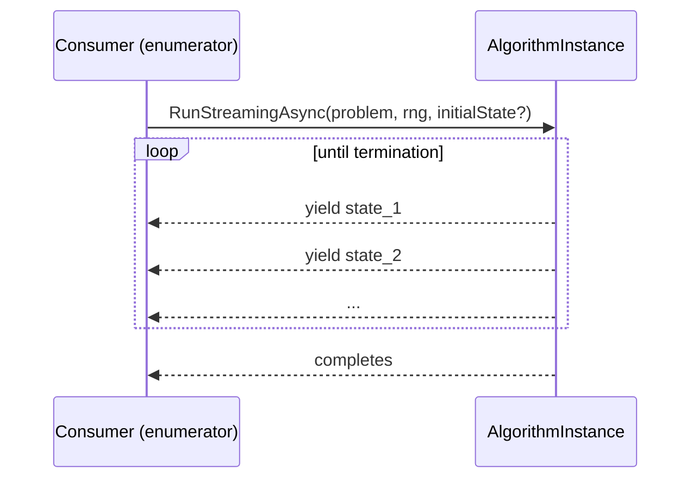
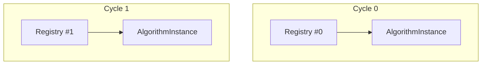

# Definition vs execution instances

HeuristicLib separates **what to run** (an algorithm/operator definition) from **the thing that actually runs** (its execution instance).

This distinction is the foundation for:

- **Stateful execution** without polluting reusable definitions
- **Instance graph deduplication** (shared sub-graphs stay shared)
- **Safe re-use** of the same definition across multiple runs

This page documents the `IExecutable<TExecutionInstance>` / `IExecutionInstance` design and how instancing behaves in practice.

## The core idea

At a high level:

- A **definition** is an object that implements `IExecutable<TExecutionInstance>`.
  - Examples: an `IAlgorithm<...>`, an `ICrossover<...>`, an `ITerminator<...>`.
  - Definitions typically hold configuration and references to other definitions (composition).
- An **execution instance** is an object that implements `IExecutionInstance`.
  - Instances hold *run-specific* state and do the actual work.

Every `IExecutable<TExecutionInstance>` must implement:

```csharp
TExecutionInstance CreateExecutionInstance(ExecutionInstanceRegistry instanceRegistry);
```

The returned instance is what you call during execution (e.g. `RunStreamingAsync(...)`, `Cross(...)`, `ShouldTerminate(...)`).

## Stateless vs stateful (better mental model)

In practice, most definitions fall into one of two groups:

### 1) Stateless definitions (definition == instance)

Stateless operators (and potentially algorithms) can act as their own instance.

In the codebase, this pattern is represented by base types like `StatelessCrossover<...>`, `StatelessEvaluator<...>`, `StatelessTerminator<...>`.

They implement both the definition interface and the instance interface, and typically do:

```csharp
public TInstance CreateExecutionInstance(ExecutionInstanceRegistry instanceRegistry) => this;
```

Example: `OrderCrossover` inherits from `SingleSolutionCrossover<...>` and therefore its execution instance is the same object.

### 2) Stateful execution (definition creates a new instance)

If an operator/algorithm needs *memory across calls* while it runs, it must create a fresh instance that carries that state.

Example: `StagnationTerminator<TGenotype>`.

- The definition holds configuration (`window`).
- The nested `Instance` holds run-specific state (`bestQualitySoFar`, `stagnationCounter`).

This is exactly the kind of logic that must not live on the definition object:

- The same terminator definition might be re-used across runs.
- A single run might be executed concurrently with another run.
- Meta-algorithms (like `CycleAlgorithm`) may decide whether state should persist across cycles.

## Why this is necessary (using `StagnationTerminator`)

`StagnationTerminator<TGenotype>.Instance` tracks whether the algorithm has improved recently:

- It remembers the **best quality so far**.
- It increments a **stagnation counter** when no improvement is seen.
- It terminates once the counter reaches the configured `window`.

If those fields were stored on the definition object itself, you would get incorrect behavior when:

- you re-run the same algorithm definition (stagnation “continues” from the previous run),
- you run the same definition multiple times in parallel,
- you embed the terminator in a meta-algorithm that wants to *control* whether terminator state resets.

Separating definition from instance keeps the reusable graph purely declarative, while allowing stateful behavior at runtime.

## Instance graph deduplication: `ExecutionInstanceRegistry`

`ExecutionInstanceRegistry` is responsible for building an **instance graph** from a **definition graph**.

Key properties:

- It caches by **reference identity** (it uses a reference equality comparer).
- It returns the *same instance* when the *same definition object reference* is requested again via `GetOrCreate(...)`.

```csharp
var instance = registry.GetOrCreate(someDefinition);
```

This enables two important patterns:

1) **Avoid duplication**: shared definition nodes become shared instances.
2) **Enable wrappers**: wrapper nodes can instance their inner operator once and decorate it.

Example: `ObservableTerminator` does:

```csharp
var inner = instanceRegistry.GetOrCreate(Interceptor);
return new ObservableTerminatorInstance(inner, Observers);
```

### Important: “equal” is not “same”

Many definitions are `record class`es and therefore have value-based equality.

The registry does **not** use value equality.

- Two distinct objects that are structurally equal will still produce distinct execution instances.
- If you want sharing, you must share the same object reference in the definition graph.

## Visualization: definition graph vs instance graph

The following diagrams intentionally show **one stateless operator** (`OrderCrossover`) and **one stateful operator** (`StagnationTerminator`).

### Definition graph (what you build/configure)

```mermaid
flowchart LR
  A[CycleAlgorithm definition]
  B[Inner Algorithm definition]
  E[Evaluator definition]
  C[OrderCrossover definition\n(stateless)]
  OT[ObservableTerminator definition]
  ST[StagnationTerminator definition\n(stateful)]

  A --> B
  B --> E
  B --> C
  B --> OT
  OT --> ST
```

### Instance graph (what actually runs)

```mermaid
flowchart LR
  AI[CycleAlgorithmInstance]
  BI[Inner AlgorithmInstance]
  EI[EvaluatorInstance]
  CDEF[OrderCrossover\n(stateless)]
  OTI[ObservableTerminatorInstance]
  STI[StagnationTerminator.Instance\n(stateful state)]

  AI --> BI
  BI --> EI
  BI --> CDEF
  BI --> OTI
  OTI --> STI

  %% Emphasize that OrderCrossover instance is the same object as its definition
  classDef stateless stroke-dasharray: 5 5;
  class CDEF stateless;
```

Notes:

- `OrderCrossover` is stateless, so the “instance node” is literally the same object.
- `StagnationTerminator` is stateful, so it creates a dedicated `Instance` object that carries run-specific fields.

## The “execution thread”: instances produce a state stream

Algorithms don’t return a single result by default; they produce a stream of states:

- `IAlgorithmInstance<...>.RunStreamingAsync(...)` returns `IAsyncEnumerable<TAlgorithmState>`.
- Enumeration *drives* execution.

An algorithm instance therefore creates an “execution thread” (a timeline) of states:



This aligns with meta-algorithms: they can interleave or concatenate streams, and observers can attach to each produced state.

## `CycleAlgorithm`: instancing per cycle vs re-using instances

`CycleAlgorithmInstance` runs a list of inner algorithms repeatedly.

For each `(cycleCount, algorithmIndex)` it:

- forks deterministic RNGs (`random.Fork(cycleCount).Fork(algorithmIndex)`),
- chooses an `ExecutionInstanceRegistry`,
- creates an algorithm instance and runs its state stream to completion.

The key switch is `NewExecutionInstancesPerCycle`.

### Option A: `NewExecutionInstancesPerCycle = true` (reset per cycle)

Each cycle gets a fresh registry, so any stateful sub-operator instances created via `GetOrCreate(...)` are reset each cycle.



Effect on `StagnationTerminator` (if the inner algorithm instantiates it via `GetOrCreate(...)`):

- stagnation counters start fresh each cycle,
- “memory” does not leak across cycles.

### Option B: `NewExecutionInstancesPerCycle = false` (persist per algorithm)

The registry is stored per *algorithm definition object* and re-used across cycles.

```mermaid
flowchart TB
  D[Algorithm definition]
  R[Registry (per algorithm definition)]
  D --> R

  R --> A0[AlgorithmInstance (cycle 0)]
  R --> A1[AlgorithmInstance (cycle 1)]
  R --> A2[AlgorithmInstance (cycle 2)]
```

Effect on `StagnationTerminator` (again, assuming the inner algorithm uses `GetOrCreate(...)` for its terminator definition):

- the *terminator instance* can persist across cycles,
- stagnation can accumulate across cycles (which may be exactly what you want in a meta-algorithm).

### A subtle but important rule

`NewExecutionInstancesPerCycle` only affects components that are created through the registry (typically via `GetOrCreate`).

- If an inner algorithm/operator directly calls `CreateExecutionInstance(...)` on a dependency every time, it can force “fresh instances” regardless of registry reuse.
- If it uses `GetOrCreate(...)`, registry reuse becomes a knob for controlling persistence.

## Practical guidance

- Use **definition objects** for composition and configuration.
- Put **mutable run state** only into execution instances.
- Use `instanceRegistry.GetOrCreate(...)` when you want:
  - shared sub-graphs to stay shared,
  - wrappers to decorate the same underlying instance,
  - registry reuse (like in `CycleAlgorithm`) to meaningfully control persistence.

## Related pages

- [Operators](operators.md)
- [Execution model](execution-model.md)
