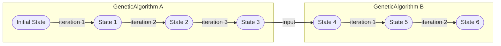

# Introduction

!! WARNING !!
This document is out of date and does not reflect the current design state of HeuristicLib!

## HeuristicLab vs HeuristicLib

General:
- No operator graph
- Hive probably container based?

HeuristicLib:
- Library
- No GUI
- No object-graph serialization
  - Only specific classes should be serialized (Algorithm Configs, Algorithm States, Genotypes, ...)

HeuristicLab (Stefan HEAL.Solvers):
- UI
- Parameters
- Operator Detection
- Uses HeuristicLib under to hood

HeuristicREST/HeuristicGRPC:
- Service
- Converts JSON/Protobuf to & from serializable HeuristicLib objects

HeuristicCLI:
...?

## General Concepts

### Algorithm Definition vs Instance


`Algorithms` and `Operators` have a "Definition" and an "Instance" part.

The Definition has parameters that a user typically would want to supply.
For example, the `GeneticAlgorithm` (definition) has a `PopulationSize` or a `Crossover` parameter.

Algorithms and Operator "definition" are immutable records.
They should be lightweight and should be easily serializable.
Therefore, Algorithm and Operator "definition" should only contain primitive types or other Algorithm or Operator "definition".

The "Instances" of an Algorithm or Operator are executable objects.
They are created from a "definition."
E.g. from a `GeneticAlgorithm` you can create a `GeneticAlgorithmInstance`.

The "instances" are usually read-only but can have an internal state which can change when the algorithm or operator is executed.

"Instances" are generally not serializable.

Usually, when an Algorithm instance is created, it creates operator instances from the corresponding operator definitions in the algorithms definition.
For example, the `GeneticAlgorithm` having a Crossover, a CrossoverInstance is created when a `GeneticAlgorithmInstance` is created.

Usually, a user does not need to know about the "instances."
Algorithms also offer an Execution method that simply creates an instance from itself and executes it.

### Algorithm State-Execution Model



Algorithms are "state-transformers."
I.e., State in -> state out.

If no input state is given, the algorithm does its initialization.

Iterative algorithms are executing state transformations in a loop.

States should be immutable and serializable.

States of one algorithm can be fed into another algorithm.
For example, execute 10 iterations on algorithm "a" and then feed the state into algorithm "b".
Of course, this only works if the state types themselves are compatible.

### Algorithm Definition vs Configuration

There is an additional distinction between an algorithm "Definition" and an algorithm "Configuration.".
A Definition is an fully specified thing that can be executed (indirectly via instance creation).
A Configuration may contain null parameters which are not yet defined.

This is useful if certain parameters are not yet defined but come from an experiment setup.
E.g. a selector might be null in the configuration, because it will be varied in an experiment.

The creation of a full definition of an algorithm from a configuration might fail if the configuration is not complete.

### Operator Model


Operators are operating on `Genotypes`.

They typically get some `Genotype` as input and return a `Genotype` as output.
E.g., a Crossover takes two `Genotype` as input and returns a new `Genotype` as output.

Additionally, an operator has a `SearchSpace`.

### SearchSpace Model


The `SearchSpace` describes the possible values of the `Genotype`.
I.e., this is the old HeuristicLab "Encoding."

SearchSpaces only describe immutable "Ranges."
E.g., a `PermutationSearchSpace` is defined by its `Length`.
E.g., a `RealVectorSearchSpace` is defined by `Length` and its `LowerBound` and `UpperBound`.

SearchSpaces can be related by being subspaces.
E.g., a `RealVectorSpace` with `Length=1` and `LowerBound=2` and `UpperBound=5` is a subspace of a `RealVectorSpace` with `Length=1` and `LowerBound=0` and `UpperBound=10`.

SearchSpaces can be converted.
E.g., a `PermutationSearchSpace` with `Length=4` can be converted to a `IntegerVectorSpace` with `Length=4` and `LowerBound=0` and `UpperBound=3`.
E.g., a `IntegerVectorSpace` can be converted to a `RealVectorSpace` with the same lengths and bounds.

### Genotype Model

Represent simple, immutable objects.
E.g., a `Permuation`, a `RealVector`, a `SymbolicExpressionTree`, etc.

### Algorithm State Model (Input State)

An algorithm state is immutable and holds the "current state" of an algorithm.

E.g., the `GeneticAlgorithmState` simply contains the current `Generation` and the current `Population` (of evaluated genotypes).

### Algorithm Result State (Output State)

An algorithm result can contain additional metainformation, that goes beyond what the (input) AlgorithmState required.
E.g., iteration Duration, Objective, OperatorMetrics (call count and duration of operator calls).

### Objective & Fitness Model

Everything is "Multi-Objective."
Single Objective is just a 1-dimensional multi-objective.

Each Objective has a Order defined that can be used to sort for selection.
Different strategies are available, such as `WeightedSum`, `Lexicographic`, `FixedDimension` (which can be simple be used to simulate single objective), ...

### Problem Model


The Problem defines "Evaluation" and "Encoding".

A problem is `Optimizable` if it has evaluation AND an encoding.
If it has only evaluation, we need to "encode" it first.

Algorithms do not care how "hidden" or "nested" the problem is.
Only a final Genotype is required for evaluation.

### Immutability

Most objects are immutable.
E.g. a Permutation is immutable. To create a changed Permutation, you have to create a new one.
This is also the case for Algorithms and Operator configurations.

**Example (C#):**

```csharp
var ga = new GeneticAlgorithm {
  PopulationSize = 100,
  Crossover = new OnePointCrossover()
  // ...other parameters...
};
// To create a new GeneticAlgorithm with a different crossover:
var ga2 = ga with { Crossover = new UniformCrossover() };
```

### Serialization


Example JSON:
```json
{
  "algorithm": {
    "type": "GeneticAlgorithm",
    "populationSize": 5,
    "crossover": { "type": "Crossover", /* ... */ }
    // ...other definitions...
  },
  "state": {
    "generation": 42,
    "population": [
      [0,1,2,3,4,5,6],
      [1,2,3,4,5,6,0],
      [2,3,4,5,6,0,1],
      [3,4,5,6,0,1,2],
      [4,5,6,0,1,2,3]
    ]
    // ...other state...
  }
}
```

Base types should be all serializable to JSON (REST) or to Protobuf (gPRC).
This includes:
- Genotypes
- Algorithm States (inputs)
- Algorithm Results (outputs)
- Algorithms (Definition/Config)
- Operator (Definition/Config)
- SearchSpaces (definitions)

Things that are generally not serializable:
- Algorithm and Operator instances (as they can have arbitrary state)
- Phenotypes (as they are from the problem domain)

### Meta Algorithms

Meta algorithms are algorithms that take other algorithms as input.
E.g., `ConcatAlgorithm` Algorithm that takes the last result of one algorithm and feeds it into the next algorithm.
Like a pipeline.
E.g., `LoopAlgorithm`, like the `ConcatAlgorithm`, but feeds the last algorithm results into the first algorithm again.

States must be compatible or we need a state converter.

### Execution Streaming Model

Execute = Execute the whole algorithm and return an `AlgorithmResult`.  
Streaming = Execute an iterative algorithm and return multiple `IterationResults`, i.e., an IEnumerable of results.

Streaming is pull-based.
Termination can be done by stop pulling.

**Example (C#):**

```csharp
// Regular execution: returns the best ISolution after the algorithm finishes
var ga = new GeneticAlgorithm { /* ... */ };
var result = ga.Execute(problem);
var best = result.BestISolution;
Console.WriteLine($"Best ISolution: {best}");

// Streaming execution: yields results for each iteration
IEnumerable<GeneticAlgorithmResult> stream = ga.Stream(problem);
foreach (var iterationResult in stream) {
  var avgQuality = iterationResult.Population.Average(ind => ind.Fitness);
  Console.WriteLine($"Generation {iterationResult.Generation}: Avg Quality = {avgQuality}");
}
```

### Solver Model

Algorithm = low-level
Solver = high-level

Algorithm returns `AlgorithmResult` or `IterationResult`, which contains alg-specific structures (e.g., a Population) of `genotypes`.

Solver returns a problem-dependent `Phenotype`.

Solver can return a single ISolution or multiple, "Solve Pareto."

Solve methods are built using extension methods on the `Algorithms`.
