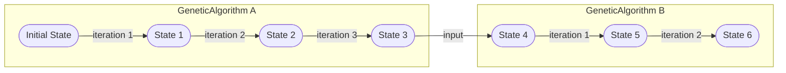

# Legacy introduction notes (archived)

This page preserves historical notes from an earlier iteration of the project.

> [!WARNING]
> The content below is not guaranteed to reflect the current code. It is kept to preserve design history and vocabulary.

## Concepts that still map well to today’s code

Even though the original notes are old, two ideas remain useful when reading the codebase:

1. **Algorithms as state transformers**: algorithms produce a sequence of immutable-looking state snapshots.
2. **Configuration vs execution**: configuration is typically expressed as records/builders, execution is an iterative loop.

The repository does not currently implement a strict “definition vs instance” split for every operator/algorithm type. Instead, many algorithms are concrete types with init-only configuration, and builder records (for example `GeneticAlgorithmBuilder`) provide a convenient configuration surface.

## Original notes (kept for reference)

### Algorithm Definition vs Instance

`Algorithms` and `Operators` have a "Definition" and an "Instance" part.

The Definition has parameters that a user typically would want to supply.
For example, the `GeneticAlgorithm` (definition) has a `PopulationSize` or a `Crossover` parameter.

Algorithms and Operator "definition" are immutable records.
They should be lightweight and should be easily serializable.
Therefore, Algorithm and Operator "definition" should only contain primitive types or other Algorithm or Operator "definition".

The "Instances" of an Algorithm or Operator are executable objects.
They are created from a "definition."
E.g. from a `GeneticAlgorithm` you can create a `GeneticAlgorithmInstance`.

The "instances" are usually read-only but can have an internal state which can change when the algorithm or operator is executed.

"Instances" are generally not serializable.

Usually, when an Algorithm instance is created, it creates operator instances from the corresponding operator definitions in the algorithms definition.
For example, the `GeneticAlgorithm` having a Crossover, a CrossoverInstance is created when a `GeneticAlgorithmInstance` is created.

Usually, a user does not need to know about the "instances."
Algorithms also offer an Execution method that simply creates an instance from itself and executes it.

### Algorithm State-Execution Model

Algorithms are "state-transformers."
I.e., State in -> state out.

If no input state is given, the algorithm does its initialization.

Iterative algorithms are executing state transformations in a loop.

States should be immutable and serializable.

States of one algorithm can be fed into another algorithm.
For example, execute 10 iterations on algorithm "a" and then feed the state into algorithm "b".
Of course, this only works if the state types themselves are compatible.

### Algorithm Definition vs Configuration

There is an additional distinction between an algorithm "Definition" and an algorithm "Configuration.".
A Definition is an fully specified thing that can be executed (indirectly via instance creation).
A Configuration may contain null parameters which are not yet defined.

This is useful if certain parameters are not yet defined but come from an experiment setup.
E.g. a selector might be null in the configuration, because it will be varied in an experiment.

The creation of a full definition of an algorithm from a configuration might fail if the configuration is not complete.

### Operator Model

Operators are operating on `Genotypes`.

They typically get some `Genotype` as input and return a `Genotype` as output.
E.g., a Crossover takes two `Genotype` as input and returns a new `Genotype` as output.

Additionally, an operator has a `SearchSpace`.

### SearchSpace Model

The `SearchSpace` describes the possible values of the `Genotype`.
I.e., this is the old HeuristicLab "Encoding."

SearchSpaces only describe immutable "Ranges."
E.g., a `PermutationSearchSpace` is defined by its `Length`.
E.g., a `RealVectorSearchSpace` is defined by `Length` and its `LowerBound` and `UpperBound`.

SearchSpaces can be related by being subspaces.

SearchSpaces can be converted.

### Genotype Model

Represent simple, immutable objects.
E.g., a `Permuation`, a `RealVector`, a `SymbolicExpressionTree`, etc.

### Algorithm State Model (Input State)

An algorithm state is immutable and holds the "current state" of an algorithm.

### Algorithm Result State (Output State)

An algorithm result can contain additional metainformation, that goes beyond what the (input) AlgorithmState required.

### Objective & Fitness Model

Everything is "Multi-Objective."

### Problem Model

### Immutability

Most objects are immutable.

### Serialization

(Archived notes about intended serialization boundaries.)

### Meta Algorithms

(Archived notes about algorithm composition.)

### Execution Streaming Model

(Archived notes about streaming termination via enumeration.)

### Solver Model

(Archived notes about a possible higher-level solver concept.)

