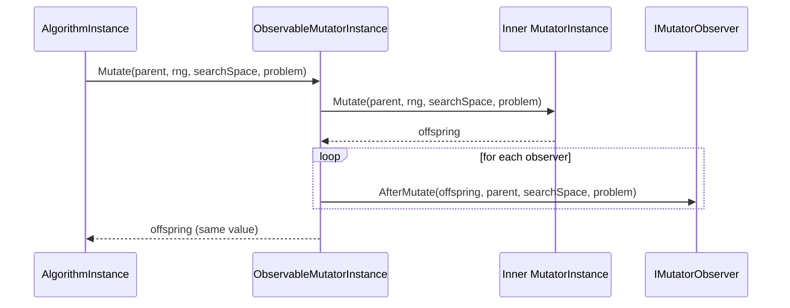

# Observability & analysis

HeuristicLib supports *observing* algorithms and operators without changing what they compute.

The core pattern is:

- Wrap an existing definition with an `Observable*` wrapper.
- At runtime, the wrapper delegates to the underlying instance.
- After the operation completes, it calls one or more **observers**.

Observers are intended for **analysis and diagnostics** (metrics, logging, traces, counters), not for influencing the optimization logic.

## The contract: observers must not change outcomes

An observer must behave like a **read-only tap**.

> [!IMPORTANT]
> Observers must not change the algorithm or operator outcome.

Concretely:

- Do not mutate objects that the algorithm will use later.
  - Many parameters are passed as `IReadOnlyList<...>`, but the *elements* may still be mutable.
- Do not depend on observer execution order.
- Do not call back into the algorithm or operator in a way that changes future behavior.

> [!WARNING]
> If an observer throws, it will typically abort the current execution because the exception bubbles out of the wrapper.
> Keep observers robust and consider handling/reporting errors inside the observer.

## Example: `ObservableMutator`

`ObservableMutator<TG, TS, TP>` is a wrapper around an `IMutator<TG, TS, TP>`.

### How it works (runtime flow)

At instancing time, it resolves the underlying mutator instance from the registry:

- `CreateExecutionInstance(...)` resolves the inner mutator from `ExecutionInstanceRegistry`.
- The returned observable instance delegates to that inner instance.

At execution time:

1. Call the underlying `mutatorInstance.Mutate(...)`.
2. For each observer: `observer.AfterMutate(result, parent, searchSpace, problem)`.
3. Return `result` unchanged.



### Observer interface

For mutators, the observer hook is:

```csharp
public interface IMutatorObserver<in TG, in TS, in TP>
{
  void AfterMutate(
    IReadOnlyList<TG> offspring,
    IReadOnlyList<TG> parent,
    TS searchSpace,
    TP problem
  );
}
```

This is intentionally **post-hoc**: it observes the produced offspring.

## Attaching observers

Most observable wrappers provide convenience extension methods.

For mutators:

- `mutator.ObserveWith(IMutatorObserver<...> observer)`
- `mutator.ObserveWith(Action<...> afterMutate)`

Example:

```csharp
IMutator<TG, TS, TP> mutator = /* ... */;

var observed = mutator.ObserveWith(offspring => {
  // read-only analysis
  // e.g. record offspring.Count, log stats, update metrics
});
```

## External sinks: `InvocationCounter`

Analysis usually needs to write somewhere.

HeuristicLib often models this as writing to an **external sink**. A minimal example is `InvocationCounter`, which is just a thread-safe counter.

### Count invocations with an existing sink

If you already have a sink (for example, a counter owned by an experiment runner), pass it in:

```csharp
IMutator<TG, TS, TP> mutator = /* ... */;
var counter = new InvocationCounter();

var observed = mutator.CountInvocations(counter);

// later: counter.CurrentCount contains total mutator invocations
```

For `ObservableMutator`, `CountInvocations(...)` increments once per mutation call.

### Count invocations with a fresh sink returned via `out`

For quick usage, many wrappers offer an overload that creates the sink and returns it:

```csharp
IMutator<TG, TS, TP> mutator = /* ... */;

var observed = mutator.CountInvocations(out var counter);

// run observed mutator as part of an algorithm
// then read counter.CurrentCount
```

This pattern keeps call sites tidy while still giving you access to the collected data.

## Relationship to analyzers

Observable wrappers are the callback mechanism; analyzers are the run-scoped architecture built on top of that mechanism.

In the current system:

- analyzer states call `RegisterObservations(ObservationPlan)`
- the observation plan stores merged observation entries
- `Run` installs merged observable replacements into each relevant `ExecutionInstanceRegistry`
- users retrieve analyzer state from the run via `GetAnalyzerResult(...)`

So observable wrappers and analyzers solve different problems:

- wrappers define **where callbacks happen**
- analyzers define **which callbacks a run should collect** and **where the analysis state lives**

## Observable operators vs analyzers: when to use which

HeuristicLib currently has **two related systems**:

1. **observable operator** system (`ObserveWith(...)`, `I*Observer`, `Observable*` wrappers)
2. **analyzer** system (`IAnalyzer`, `CreateRun(problem, analyzers...)`, `GetAnalyzerResult(...)`)

They are not competitors. The analyzer system is built **on top of** observable operators.

### Observable operators

Use observable operators when you want a **local callback hook** on one concrete algorithm or operator definition.

Typical characteristics:

- scope is tied to the wrapped definition and the execution instances created for it
- you usually provide a callback, observer object, logger, or external sink
- the result typically lives **outside** the run
  - for example in an `InvocationCounter`, a logger, a list you own, or a custom observer instance
- best for lightweight instrumentation, diagnostics, logging, counters, and ad-hoc experiments

Typical API shape:

```csharp
var observedEvaluator = evaluator.ObserveWith((genotypes, qualities, searchSpace, problem) => {
  // local side effect
});
```

Good fits:

- count how often one operator is called
- log every evaluation or mutation
- attach a temporary diagnostic hook during development
- expose a callback to external tooling that already owns the result sink

### Analyzers

Use analyzers when you want a **run-scoped analysis object** that is part of the logical execution.

Typical characteristics:

- scope is tied to the `Run`, not to one short-lived execution instance
- mutable analysis state is stored inside the analyzer state object
- the run creates that state once and lets you retrieve it later
- multiple hook points can be combined into one coherent analysis object
- best for reusable analysis features such as quality curves, genealogy, traces, or iteration statistics

Typical API shape:

```csharp
var analyzer = new QualityCurveAnalysis<TGenotype, TSearchSpace, TProblem>(evaluator);
var run = algorithm.CreateRun(problem, analyzer);
var finalState = run.RunToCompletion(random);
var result = run.GetAnalyzerResult(analyzer);
```

Good fits:

- quality curves that should span the whole run
- genealogy graphs that should survive registry recreation inside meta-algorithms
- reusable analysis modules you want to pass around as part of the API
- analysis that combines several observed operators into one result object

### Practical rule of thumb

Use **observable operators** when you want a **tap**.

Use **analyzers** when you want a **run-owned analysis object**.

### Comparison table

| Question | Observable operators | Analyzers |
|---|---|---|
| Main purpose | local callback / instrumentation | reusable run-scoped analysis |
| Lifetime | execution-instance-driven | run-driven |
| State lives where? | usually in an external sink or observer object | in the analyzer state returned by the run |
| Retrieval model | you keep the sink yourself | `run.GetAnalyzerResult(analyzer)` |
| Number of hook points | often one | one or many |
| Best for | logging, counters, quick diagnostics | quality curves, genealogy, reusable analysis modules |
| Relation to the other system | foundation | built on top of observable operators |

### Which one should library users prefer?

- Prefer **analyzers** for reusable runtime analysis features that should conceptually belong to a run.
- Prefer **observable operators** for quick instrumentation, ad-hoc diagnostics, and cases where an external system already owns the result sink.
- If you are implementing a reusable analysis feature inside HeuristicLib, the preferred direction is usually:
  - use observable operators as the hook mechanism
  - expose the feature as an analyzer

## Where to look in the code

Observable wrappers follow a consistent pattern:

- Wrap a definition.
- Resolve underlying dependencies via `ExecutionInstanceRegistry`.
- Delegate to the underlying instance.
- Notify observers *after* the operation.

Examples include observable wrappers for mutators, crossovers, evaluators, terminators, selectors, replacers, interceptors, and creators.

## Related pages

- [Operators](operators.md)
- [Execution model](execution-model.md)
- [Definition vs execution instances](execution-instances.md)
- [Analyzer architecture](analyzer-architecture.md)
