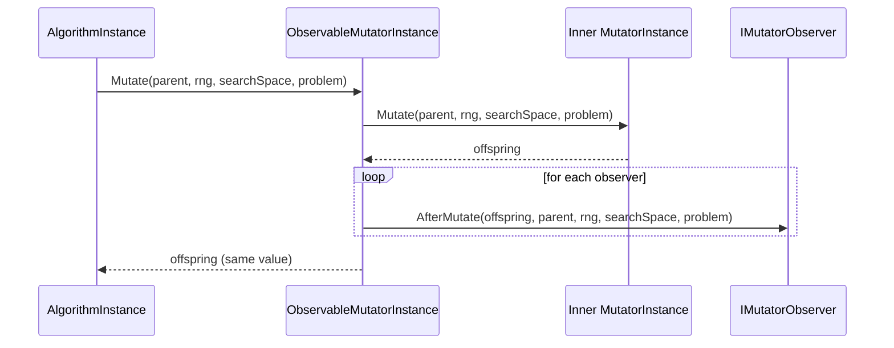

# Observability & analysis

HeuristicLib supports *observing* algorithms and operators without changing what they compute.

The core pattern is:

- Wrap an existing definition with an `Observable*` wrapper.
- At runtime, the wrapper delegates to the underlying instance.
- After the operation completes, it calls one or more **observers**.

Observers are intended for **analysis and diagnostics** (metrics, logging, traces, counters), not for influencing the optimization logic.

## The contract: observers must not change outcomes

An observer must behave like a **read-only tap**.

> [!IMPORTANT]
> Observers must not change the algorithm/operator outcome.

Concretely:

- Do not mutate objects that the algorithm will use later.
  - Many parameters are passed as `IReadOnlyList<...>`, but the *elements* may still be mutable.
- Do not depend on observer execution order.
- Do not call back into the algorithm/operator in a way that changes future behavior.
- Treat the `IRandomNumberGenerator` parameter as **diagnostic-only**.
  - Many observer interfaces currently receive `random`, but using it for additional draws can accidentally couple your analysis to execution details.

> [!WARNING]
> If an observer throws, it will typically abort the current execution because the exception bubbles out of the wrapper.
> Keep observers robust and consider handling/reporting errors inside the observer.

## Example: `ObservableMutator`

`ObservableMutator<TG, TS, TP>` is a wrapper around an `IMutator<TG, TS, TP>`.

### How it works (runtime flow)

At instancing time, it creates a wrapper instance around the underlying mutator instance:

- `CreateExecutionInstance(...)` calls `instanceRegistry.GetOrCreate(Mutator)`.
- The returned `ObservableMutatorInstance` delegates to that instance.

At execution time:

1. Call underlying `mutatorInstance.Mutate(...)`.
2. For each observer: `observer.AfterMutate(result, parent, ...)`.
3. Return `result` unchanged.



### Observer interface

For mutators, the observer hook is:

```csharp
public interface IMutatorObserver<in TG, in TS, in TP>
{
  void AfterMutate(
    IReadOnlyList<TG> offspring,
    IReadOnlyList<TG> parent,
    IRandomNumberGenerator random,
    TS searchSpace,
    TP problem
  );
}
```

This is intentionally **post-hoc**: it observes the produced offspring.

## Attaching observers

Most observable wrappers provide convenience extension methods.

For mutators:

- `mutator.ObserveWith(IMutatorObserver<...> observer)`
- `mutator.ObserveWith(Action<...> afterMutate)`

Example (pseudocode):

```csharp
IMutator<TG, TS, TP> mutator = /* ... */;

var observed = mutator.ObserveWith(offspring => {
  // read-only analysis
  // e.g. record offspring.Count, log stats, update metrics
});
```

## External sinks: `InvocationCounter`

Analysis usually needs to write somewhere.

HeuristicLib often models this as writing to an **external sink**. A minimal example is `InvocationCounter`, which is just a thread-safe counter.

### Count invocations with an existing sink

If you already have a sink (for example, a counter owned by an experiment runner), pass it in:

```csharp
IMutator<TG, TS, TP> mutator = /* ... */;
var counter = new InvocationCounter();

var observed = mutator.CountInvocations(counter);

// later: counter.CurrentCount contains total offspring produced by the mutator
```

For `ObservableMutator`, `CountInvocations(...)` increments by `offspring.Count`.

### Count invocations with a fresh sink returned via `out`

For quick usage, many wrappers offer an overload that creates the sink and returns it:

```csharp
IMutator<TG, TS, TP> mutator = /* ... */;

var observed = mutator.CountInvocations(out var counter);

// run observed mutator as part of an algorithm
// then read counter.CurrentCount
```

This pattern keeps call sites tidy while still giving you access to the collected data.

## Observable algorithms

Operators are not the only place where analysis hooks exist.

The codebase also contains `ObservableAlgorithm<TG, TS, TP, TR>`, which wraps an `IAlgorithm<...>` and calls observers after each yielded state.

This is useful when you want to track iteration-level metrics (quality curves, population stats) without modifying algorithm logic.

## Where to look in the code

Observable wrappers follow a consistent pattern:

- Wrap a definition.
- Instance underlying dependencies via `ExecutionInstanceRegistry`.
- Delegate to the underlying instance.
- Notify observers *after* the operation.

Examples include observable wrappers for mutators, crossovers, evaluators, terminators, selectors, replacers, interceptors, and algorithms.

## Related pages

- [Operators](operators.md)
- [Execution model](execution-model.md)
- [Definition vs execution instances](execution-instances.md)
