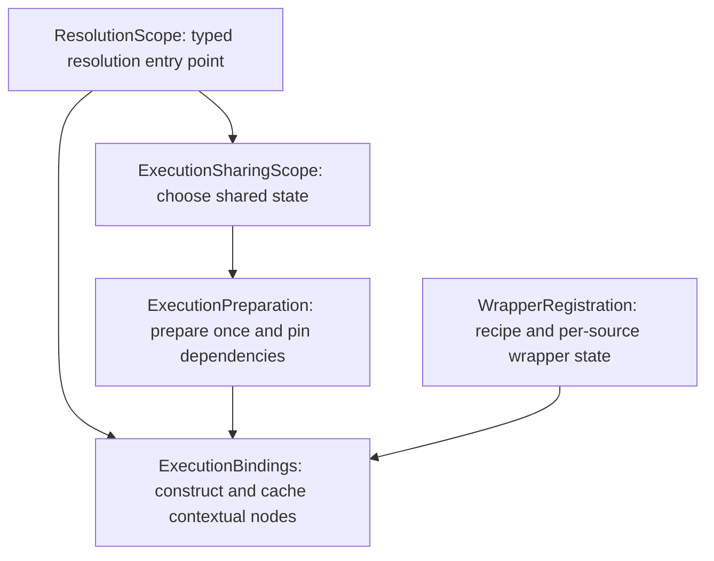

# Typed execution factories: concrete design

Status: the selected option-C design is implemented through candidate 1 from the [comparison](execution-bindings-design-investigation.md). The naming migration is `d5ad7fb2`, common factory/resolver implementation is `aa72a5a7`, consumer migration is consolidated as `85c1b24f`, and reviewed M3 repairs end at `4cc36826`. The [final foundation gate](execution-bindings-and-shared-state.md#final-foundation-gate-2026-10-06) verifies the integrated implementation and closes its validation. Review that acceptance record before selector registration. Pre-squash package IDs and proposal wording below are design/checkpoint history, not unresolved migration instructions.

This document specifies the design and its original review decisions. C2/C3 local proofs are historical reference evidence; normal core, API usage, Experimental and scenario assertions establish integrated behavior. User-facing current contracts live in the architecture and authoring documentation. C4 performance acceptance is recorded for the measured migration checkpoint; later repairs have functional verification without new timing claims.

## Agreed naming family

Decision, 2026-09-27: use graph vocabulary for the common contracts and execution vocabulary for role-specific runtime types. The user selected `IConfigurationNode` and `IExecutionNode`; ordinary users continue to compose `IMutator`, `IOperator`, concrete mutators and algorithms. They do not need a general graph API. Implement the rename with the resolution/factory rework, in a separate behavior-preserving commit before the behavior change.

| Previous name or concept | Agreed name | Migration boundary |
| --- | --- | --- |
| `IExecutionConfiguration`, including its generic form | `IConfigurationNode`, including its generic form | Naming commit; preserve existing members and semantics. |
| `IExecutionInstance` | `IExecutionNode` | Naming commit. |
| `IOperatorInstance`, `IMutatorInstance<...>`, `IAlgorithmInstance<...>` and other role execution contracts | `IOperatorExecution`, `IMutatorExecution<...>`, `IAlgorithmExecution<...>` and corresponding `...Execution` contracts | Naming commit; keep generic arities and constraints. |
| `MutatorInstance<...>`, `WrappingMutatorInstance<...>`, `IterativeAlgorithmInstance<...>` and corresponding runtime bases/types | `MutatorExecution<...>`, `WrappingMutatorExecution<...>`, `IterativeAlgorithmExecution<...>` and corresponding `...Execution` types | Naming commit; also migrate matching extension classes, filenames and authoring examples. |
| Runtime type parameters and nested implementation names | `TExecution` and `Execution` in the authoring examples | Naming commit where they describe these runtime objects; do not rename unrelated uses of `Instance`, including singleton properties. |
| `IOperator`, `IMutator<...>`, `IAlgorithm<...>` and concrete configuration types | Retain their domain names without `Node` | No naming change. |
| Prepared typed factory | `ExecutionFactory<TExecution>` | Introduced by the factory/resolution commit. |
| `CreateExecutionInstance(...)` | `CreateExecutionFactory()` with the reviewed run type parameters | Factory/resolution commit, because this changes what is returned and when state is initialized. |
| Resolution and declaration APIs | Retain `ResolutionScope`, typed scope views, `ResolutionScopeBuilder`, `Resolve`, `ResolveOptional`, `TryResolve`, `CreateChildScope` and `Wrap` | Names retained; behavioral/API extensions remain subject to their design review. |
| Source selection and setup contributions | Retain `NodeSelector<TConfiguration>`, `IExecutionModule` and `Install` | Names retained. |
| Compatibility and run lifecycle | Retain `ExecutionSignature`, `Fits`, `AlgorithmRun`, `ExperimentRun`, `Attach`, `AttachPerTrial` and `GetAttached` | Names and responsibilities retained. |

In prose, a configuration node belongs to the configuration graph; an execution node is the resolved callable object in the execution graph. Use role-specific forms such as *mutator execution* and *algorithm execution*. An execution node is not one invocation, an entire run or the persistent resolver record. Its identity need not identify the persistent state it accesses. Keep *execution state* distinct from public *search state*.

`Node` appears on the common contracts, not every derived role: use `IMutatorExecution`, not `IMutatorExecutionNode`. No shared `INode`, public child-enumeration contract or universal `Execute` method follows from this naming. Configuration-node identity remains configuration-object reference identity, not one identity per caller path. Node selectors select source configurations; advice applies at operations on their execution nodes.

Binding remains a descriptive word for constructing scope-specific dependencies and observations; it is not the public type family. `IExecutionBinding`, bare `IExecution`, bare `IConfiguration` and definition-based names are not selected. This does not change state-sharing policy or approve the remaining proposed control, child-scope or protected factory-hook APIs.

The naming migration uses the agreed names in source, links and examples. Object-returning creation methods retain their existing names in the shipping library. The core factory examples below were validated during C2. The [naming commit boundary](execution-bindings-and-shared-state.md#agreed-commit-boundaries) keeps the rename separate from the return-type and resolution changes.

## 1. What changes for each audience

| Audience | Proposed change |
| --- | --- |
| Configuring and running algorithms | None: compose configurations, attach modules and resolve/start normally. No state-store, binding or factory management. |
| Stateless and ordinary stateful leaf authors | Existing operation overrides and `CreateInitialState()` remain. Framework bases implement preparation and binding. |
| Explicit leaf authors | Return a factory; construct the reusable raw leaf once outside its lambda when it has no scope-dependent children. |
| Composite authors | Prepare persistent fields and derived configurations once; return a lambda that resolves typed children and creates the execution node. Operations keep their existing role signatures. |
| Algorithm authors | Same split as composites. Iterative bases continue resolving interceptors. Search progress remains in the invocation. |
| Meta-algorithm and budget authors | Use explicit fresh or retained child scopes; never retain wrapped child instances in shared data. |
| Resolver and instrumentation authors | Own logical identity, dependency selection, binding caches, generated-wrapper identities and failure publication. |

An execution node is the concrete object on which `Mutate`, `Evaluate` or `RunStreamingAsync` is called. It may be a scope-specific binding over persistent execution data. The descriptive terms *execution preparation*, *sharing scope*, *binding context* and *construction frame* below name implementation responsibilities, not new public objects ordinary authors must construct. The execution preparation is the persistent owner; it must not also be called an execution node. Its eventual internal CLR name remains an implementation choice.

## 2. Core and role contracts

Use one public factory method, `CreateExecutionFactory`, replacing `CreateExecutionInstance`. Preparation is synchronous, scope-free and performed once for the selected execution preparation. Its result is a typed delegate invoked during resolution, never on each operator call.

```csharp
public delegate TExecution ExecutionFactory<out TExecution>(ResolutionScope scope)
    where TExecution : class, IExecutionNode;

public interface IConfigurationNode<out TExecution> : IConfigurationNode
    where TExecution : class, IExecutionNode
{
    ExecutionFactory<TExecution> CreateExecutionFactory();
}

// Members on ResolutionScope; these replace the old creation overloads.
public TExecution Resolve<TConfiguration, TExecution>(
    TConfiguration configuration,
    Func<TConfiguration, ExecutionFactory<TExecution>> prepare)
    where TConfiguration : class, IConfigurationNode
    where TExecution : class, IExecutionNode;

public TExecution Resolve<TExecution>(IConfigurationNode<TExecution> configuration)
    where TExecution : class, IExecutionNode;
```

The marker `IConfigurationNode`, `Fits`, typed scope views, `ResolveOptional` and `TryResolve` keep their responsibilities. A consumer-defined role can use the generic overload without library registration. Do not introduce a built-in role switch. Add the reference-type constraint to the nongeneric-run configuration contract consistently with the existing resolver; audit direct implementers during migration.

For a mutator, the run types still arrive as method type parameters:

```csharp
public interface IMutator<TCandidate> : IOperator
{
    ExecutionFactory<IMutatorExecution<TCandidate, TRunSearchSpace, TRunProblem>>
        CreateExecutionFactory<TRunSearchSpace, TRunProblem>()
        where TRunSearchSpace : class, ISearchSpace<TCandidate>
        where TRunProblem : class, IProblem<TCandidate, TRunSearchSpace>;
}

// Body of the existing role-specific Resolve extension:
scope.Resolve(mutator, static target => target.CreateExecutionFactory<TSearchSpace, TProblem>());
```

`typed.Resolve(mutator)` and every operation signature stay the same. Algorithms make the equivalent change to both `IAlgorithm<TCandidate>` and `IAlgorithm<TCandidate, TSearchState>`. Bound authoring bases validate their run types before preparing or binding children, then adapt the delegate's result with the same checked variance bridge used today. The core records the prepared instance contract and checks compatible reuse; a request for an incompatible closed role must fail, not create a second state under the same selected source. The proof must cover contravariant operator interfaces and invariant algorithm search states rather than assuming all generic delegates can be cast identically.

Calling `CreateExecutionFactory()` directly creates another preparation; invoking its delegate directly bypasses resolution. These are authoring hooks, not the user workflow. No compatibility `CreateExecutionInstance` method remains after migration. The delegate is runtime construction data, not a persisted configuration strategy, so it does not replace the value strategies required by guideline § 4.8.

Configuration-only validation moves to preparation. Validation that genuinely depends on resolved children happens while binding. Neither phase may execute an operator, draw random values or advance an algorithm. Binding constructors only wire dependencies and binding-local data; they do not reset persistent state.

## 3. Identity, ownership and resolution

### Resolver responsibilities

`ResolutionScope` is the public entry point and the scope passed to factories. It routes selection through the proper owner, verifies the requested contract, and obtains the current nodes from `ExecutionBindings`. It does not own their dictionaries or construction state machines.

| Component | Responsibility and ownership |
| --- | --- |
| `ExecutionSharingScope` | Local configuration-reference selections, ancestor lookup, retained standalone child scopes, ancestry checks and the active construction guard shared by related scopes. It decides where state is shared, not how nodes are built. |
| `ExecutionPreparation` | One selected configuration's preparation attempt, typed factory or sticky preparation fault, pinned dependencies and retained children. Persistent state lives in its prepared factory. It can be unprepared or faulted and is not an `IExecutionNode`. |
| `ExecutionBindings` | Ordered declarations and their current depth, node construction, raw/completed node caches and binding faults, plus retained child bindings. Empty observation layers can read ancestor nodes, but never publish nodes upward. |
| `WrapperRegistration` | One stable recipe, its source/declaring sharing scope/module flag/sequence, and weak-key per-source wrapper preparations. Its private `PreparedWrapper` owns the generated wrapper, state and private sharing scope. |

Selection precedes preparation so a failure cannot replace a dependency's identity. Construction guarding precedes cache reuse. The collaborators encapsulate these rules rather than exposing dictionaries for the public scope to manipulate.

The private caches can erase execution types and check them on recovery; role operations remain statically typed. These components introduce no second public scope abstraction, generic invocation or service lookup.

### Wrapper registration and internal ownership

Naming decision, 2026-09-27: the user approved `Wrap`, `WrapperRegistration` and `WrappedNodes`. M1a now uses these names and removes the public `DecorationOrigin` enum. This supersedes the earlier decision to retain `Decorate`. The later advice contracts remain open.

**Required follow-up after the AOP rework:** the user remains dissatisfied with the resolver's design and wants its complexity, component boundaries and public wrapper/advice registration API revisited once the AOP implementation is available. Committing this checkpoint is not final approval of the architecture. Track this reassessment in [AOP review package 11](container-and-aspect-framing.md#review-packages).

Use **wrapper registration** for the construction mechanism. A registration selects an original configuration and supplies a recipe for wrapping its execution. Handwritten typed wrappers remain an agreed foundation of the later AOP work. **Advice** can name the later operation-level behavior once its typed contracts are reviewed. **Observation** remains the narrower, read-only glossary concept.

The family is `NodeSelector` for selection, `Wrap` for the low-level builder operation, `WrapperRegistration` for one registered recipe, **wrapper chain** for the composed executions, and `IExecutionModule.Install` for a group of setup contributions. The resolver still matches exact references; selector integration remains a later package.

The remaining internal classes are storage owners, not interchangeable services or a new public framework. Their exact class boundaries are implementation choices. Their independent identities and lifetimes follow from the required behavior:

| Stored information | Why it cannot be combined into one cache |
| --- | --- |
| Sharing-scope selections | Several factory frames and observation contexts can refer to the same selected state. Keeping a sharing scope alive must not itself retain all observing contexts. |
| A selected execution's preparation | Its factory, pinned dependencies and preparation fault survive contextual node reconstruction. Different configurations in one sharing scope have separate preparation attempts. |
| Contextual bindings | Parent and child can need different nodes over the same preparation. Their node caches, wrappers and binding failures belong to those contexts. |
| A wrapper registration | One recipe can prepare separate wrapper state for different selected executions. Two registrations of the same recipe remain two contributions. |

For example, parent and child calls can advance the same mutator counter while only child calls reach a child observer. Merging state selection with the bound-node cache would need another way to represent that pair of identities. Combining these objects into the public scope would require modes or references between scopes and would still need separate storage for those lifetimes. The current implementation keeps the separation explicit; it does not claim that four top-level classes are inherently required.

`WrappedNodes` is a small immutable carrier nested under `ExecutionBindings`. `RetainedChildScope` is nested under `ExecutionSharingScope` and preserves its once-only declaration attempt and failure. Wrapper preparation, node construction and registration placement remain private helpers. There is no registration inheritance hierarchy.



The arrows show participation in resolution, not strong-reference ownership. A factory's scope resolves children through its owning preparation's pinned dependencies. Actual weak/strong ownership follows the lifetime requirements below.

**Ordering remains unchanged.** Each registration records internally whether it was made during module installation. Configuration registrations bind inside module registrations, deeper effective scopes inside shallower, then declaration sequence breaks ties. Nested `Install` calls restore the previous installation state. This keeps duration budgets inside observer callbacks and preserves clock-before-trace reads without a public origin enum or precedence setting.

**The later AOP integration belongs at the registration boundary.** The selector package replaces exact-reference matching there with the reviewed `NodeSelector` integration. Matching sees original source configurations, including explicitly configured wrappers, and excludes generated wrappers. Per-source wrapper preparation stays owned by the registration and keyed by the selected preparation with weak retention. A shared selector does not establish shared advice state.

Before/after/throwing/finally/around failure and continuation semantics, predicate-failure caching, general caller-path selection and algorithm iterator boundaries remain the explicit review gates in [D2-D5](container-and-aspect-framing.md#decisions-before-dependent-implementation). `WrappedNodes` is construction data; it is not a per-operation `Proceed` callback. The resolver has no knowledge of advice kinds or generic invocation.

This revision migrates source, callers, tests, glossary and resolution diagrams together. It remains part of M1a, with the known role-adapter compilation barrier and a review stop before M1b.

### Direct resolution versus dependency resolution

1. Direct `scope.Resolve(M)` consults that sharing scope's pinned selection, then existing ancestor selections. Wrappers do not stop state lookup. On a miss, create the execution preparation locally; never populate an ancestor merely to share it with siblings.
2. Remember a direct selection, including a reused ancestor selection, so subsequent resolutions do not switch identity when another cache is populated later. Distinct configuration references never merge because their records compare equal.
3. The factory for G receives a construction frame. Its `scope.Resolve(M)` first consults G's recorded dependency for that source reference. If selected already, bind that exact execution preparation for the frame's context; do not rerun C's direct selection.
4. A new dependency is selected through the frame's sharing scope, using the same local/ancestor rules, then pinned to G. Fixed dependencies resolve on first binding. Deferred dependencies retain this frame explicitly; dynamically repeated independent executions use child domains as described below.
5. Build/cache the typed raw binding, apply its declaration chain, then return the completed binding. Different observer contexts can require different bindings even if no declaration matches G itself: its descendants may match.

This yields the following collision policy:

| Sequence | Required identity |
| --- | --- |
| C resolves M before P does | C owns M_child. P later owns M_parent. |
| P builds G using M_parent | G permanently selects M_parent for that dependency. |
| C resolves the ancestor G | G's C binding calls M_parent through C's observation context. |
| C directly resolves M again | Still M_child. Rebinding G does not overwrite C's direct selection. |

Two M states are consequently reachable from C through different logical graphs. This is deliberate dependency continuity, not two states in one direct cache slot. The alternative, substituting M_child into G, would preserve only G's own fields and silently change its existing execution graph.

The sharing scope of an already-shared G remains its original one; C supplies observation context rather than adopting G's dependency ownership. A previously unselected dependency resolved directly through G's retained frame belongs to that original domain, even if first triggered by a C binding. This explicitly extends the original execution graph; it is not a direct `C.Resolve(M)` request. New per-invocation children must use a fresh child domain and stay there. Include this distinction in the late-resolution tests and review: otherwise the phrase "no hoisting" hides an unresolved policy for delayed dependencies.

Repeated resolution of the same source in one frame means the same logical dependency. Two independent children using the same configuration reference require distinct child domains; call order is not a dependency identifier. Recreating a derived configuration inside every binder would create another reference: authors must prepare it once. Existing guidance allowing explicit children on execution nodes becomes a rule about binding-local children, not shared persistent data.

### Cache and lifetime rules

- Cache by execution preparation and full binding context, not configuration plus its own matching declarations. A child-only match can change a parent's binding requirements.
- An empty child scope with an identical full context may reuse the ancestor binding. A changed context conservatively rebinds; do not add dependency-completeness optimizations before measurement.
- Stateful leaf bases can reuse their one raw leaf instance while wrapper chains differ. Stateless bases can keep returning `this`. Composite raw nodes belong to their execution bindings.
- A long-lived execution preparation must not own a strong dictionary of every short-lived observation context and binding. Execution bindings own node caches; preparations own persistent state/dependency selections and explicitly retained child sharing scopes. Fresh Cycle/Pipeline child bindings must be collectible when their invocation releases them.
- Generated occurrences need both source and declaration lifetimes. Use declaration-owned weak-key storage, such as `ConditionalWeakTable<ExecutionPreparation, PreparedWrapper>`: a surviving declaration must not retain every source it once observed, and a surviving source must not retain expired child declarations. An occurrence may reference its key record; the storage must support that relationship without turning it into a strong-key cache. Active execution bindings retain the declarations and selected preparations they use. Include both lifetime directions in collection tests.
- A weak-table value must not retain its owning declaration/table, directly or through a declaring domain's retained slots. That back-reference can keep an expired declaration alive while its source remains alive. Pass the declaration into occurrence preparation instead of storing it on the occurrence, and keep binding frames out of prepared configurations and persistent advice data. A private advice domain uses a weak link when its parent is supplied by the declaration rather than the source's own ancestry; the declaration and active contextual views keep that parent alive for binding and deferred dependency selection. Execution preparations likewise refer weakly to their owning domain, so a pinned extra dependency cannot indirectly retain the declaration through that domain's slots. Scopes, construction frames, retained child slots and occurrences own the domains needed for future resolution. Ordinary logical parent links remain strong. Include these weak references in C4's allocation and resolution-cost measurements.
- Stable declaration identities, not captured callback equality, select advice occurrences. Installing the same module twice in one builder retains current idempotence; two separate declarations remain two occurrences.
- Sharing data does not make calls concurrent-safe. Preserve existing serialization requirements. Do not add locks, asynchronous construction or parallel resolution as part of this change.

## 4. Authoring examples

The changes below keep the real run type parameters visible. Imports and unchanged containing-type members are omitted where the source link provides them; no fictitious reduced role signatures stand in for production signatures.

### Stateless and stateful leaves

`NoChangeMutator<TCandidate>` continues to override `MutateCandidate`; ordinary `StatefulMutator<..., TState>` subclasses continue to override `CreateInitialState` and `Mutate`. Only base implementation changes:

```csharp
// In StatelessMutator<TCandidate, TSearchSpace, TProblem>:
public sealed override ExecutionFactory<IMutatorExecution<TCandidate, TSearchSpace, TProblem>>
    CreateExecutionFactory() => _ => this;

// In StatefulMutator<TCandidate, TSearchSpace, TProblem, TState>:
public sealed override ExecutionFactory<IMutatorExecution<TCandidate, TSearchSpace, TProblem>>
    CreateExecutionFactory()
{
    var execution = new Execution(this, CreateInitialState());
    return _ => execution;
}
```

`CreateInitialState` therefore runs once per execution preparation, not once per observer context. Framework-managed leaf state still must not retain configurations, scopes, child execution nodes or child-bound delegates. An explicit stateful leaf such as GaussianMutator can also create its raw instance in preparation, so its current strength survives every wrapped binding without a separate empty state wrapper.

### A stateful non-terminal: predefined candidates

[PredefinedCandidatesCreator](../src/HeuristicLib/Operators/Creators/PredefinedCandidatesCreator.cs) now stores its cursor in `ExecutionState` after M0a. The remaining factory migration moves that allocation into preparation:

```csharp
public ExecutionFactory<ICreatorExecution<TCandidate, TRunSearchSpace, TRunProblem>>
    CreateExecutionFactory<TRunSearchSpace, TRunProblem>()
    where TRunSearchSpace : class, ISearchSpace<TCandidate>
    where TRunProblem : class, IProblem<TCandidate, TRunSearchSpace>
{
    var state = new ExecutionState();
    return scope => new Execution<TRunSearchSpace, TRunProblem>(
        state, scope.Resolve<TCandidate, TRunSearchSpace, TRunProblem>(CreatorForRemainingCandidates), PredefinedCandidates);
}

private sealed class ExecutionState
{
    public int CurrentCandidateIndex;
}
```

The existing instance constructor takes `ExecutionState state` in addition to the existing fallback and candidate values. Its `Create` body replaces `currentCandidateIndex` with `state.CurrentCandidateIndex`; its call to `creatorForRemainingCandidates.Create(...)` is unchanged. Consuming seeds through a parent and then a child binding advances one cursor and observes only the fallback calls that actually occur.

Cost to this author: one private state class, one constructor parameter and one lambda. No public state type, execution-record handle, new generic dimension or changed operation signature.

### A consumer-defined role with two different children

This complete role/configuration sketch uses ordinary repository role interfaces. It does not need a new overload in the library's role-resolution extensions:

```csharp
public interface IProbeExecution<TCandidate, TSearchSpace, TProblem> : IExecutionNode
    where TSearchSpace : class, ISearchSpace<TCandidate>
    where TProblem : class, IProblem<TCandidate, TSearchSpace>
{
    int Calls { get; }
    IReadOnlyList<ObjectiveVector> Probe(IReadOnlyList<TCandidate> input,
        IRandomNumberGenerator random, TSearchSpace searchSpace, TProblem problem);
}

public sealed record Probe<TCandidate, TSearchSpace, TProblem>
    : IConfigurationNode<IProbeExecution<TCandidate, TSearchSpace, TProblem>>
    where TSearchSpace : class, ISearchSpace<TCandidate>
    where TProblem : class, IProblem<TCandidate, TSearchSpace>
{
    public required IMutator<TCandidate> Mutator { get; init; }
    public required IEvaluator<TCandidate> Evaluator { get; init; }

    public ExecutionFactory<IProbeExecution<TCandidate, TSearchSpace, TProblem>> CreateExecutionFactory()
    {
        var state = new ExecutionState();
        return scope =>
        {
            var typed = scope.For<TCandidate, TSearchSpace, TProblem>();
            return new Execution(state, typed.Resolve(Mutator), typed.Resolve(Evaluator));
        };
    }

    private sealed class ExecutionState { public int Calls; }

    private sealed class Execution(ExecutionState state,
        IMutatorExecution<TCandidate, TSearchSpace, TProblem> mutator,
        IEvaluatorExecution<TCandidate, TSearchSpace, TProblem> evaluator)
        : IProbeExecution<TCandidate, TSearchSpace, TProblem>
    {
        public int Calls => state.Calls;

        public IReadOnlyList<ObjectiveVector> Probe(IReadOnlyList<TCandidate> input,
            IRandomNumberGenerator random, TSearchSpace searchSpace, TProblem problem)
        {
            var mutated = mutator.Mutate(input, random, searchSpace, problem);
            var result = evaluator.Evaluate(mutated, random, searchSpace, problem);
            state.Calls++;
            return result;
        }
    }
}
```

Before the change, preparation and the lambda body were one `CreateExecutionInstance(scope)` method, and `Calls` was an instance field. Afterwards the two child-resolution expressions and typed calls are identical. `scope.Resolve(probe)` still infers the returned role. A consumer observing `Probe` supplies its own typed wrapper, using the same wrapper facility as built-in roles.

### Wrapping and multi bases

Keep child resolution centralized, but move the protected hook outside per-binding construction. On `WrappingMutator<TCandidate>`:

```csharp
public ExecutionFactory<IMutatorExecution<TCandidate, TRunSearchSpace, TRunProblem>> CreateExecutionFactory<TRunSearchSpace, TRunProblem>()
    where TRunSearchSpace : class, ISearchSpace<TCandidate>
    where TRunProblem : class, IProblem<TCandidate, TRunSearchSpace>
{
    var wrap = CreateWrapperFactory<TRunSearchSpace, TRunProblem>();
    return scope => wrap(scope.Resolve<TCandidate, TRunSearchSpace, TRunProblem>(ChildMutator));
}

protected abstract WrapperExecutionFactory<IMutatorExecution<TCandidate, TRunSearchSpace, TRunProblem>> CreateWrapperFactory<TRunSearchSpace, TRunProblem>()
    where TRunSearchSpace : class, ISearchSpace<TCandidate>
    where TRunProblem : class, IProblem<TCandidate, TRunSearchSpace>;
```

A stateless wrapper returns `child => new Execution<TRunSearchSpace, TRunProblem>(child, setting)`. A stateful wrapper creates its shared cache/counter first, then returns `child => new Execution<...>(child, cache)`. For example, [CachingEvaluator](../src/HeuristicLib/Operators/Evaluators/CachingEvaluator.cs) moves its `MemoryCache` allocation out of the binding instance's field initializer into preparation. Its transient batch lists stay invocation-local.

Multi bases apply the same pattern through `CreateCompositeFactory`, returning `CompositeExecutionFactory<TExecution>` with the existing ordered `ImmutableArray<TExecution>` as its input. Order, repeated references and empty arrays are preserved. Matching execution bases and protected child properties remain. `WrapperExecutionFactory<TExecution>` and `CompositeExecutionFactory<TExecution>` use one execution role interface for their children and result. Derived authors construct the matching execution class inside the delegate rather than declaring a more specific result type on the factory. This replaces `WrapExecutionInstance` and `CombineExecutionInstances`, rather than adding another optional authoring route alongside them. The additional delegate is construction-only and must be included in allocation measurements.

Decision, 2026-09-30: the user approved a named factory family to replace the raw `Func` hook signatures. `ExecutionFactory<TExecution>` remains the scope-to-node factory. `WrapperExecutionFactory<TExecution>` accepts one typed child; `CompositeExecutionFactory<TExecution>` accepts an immutable array of typed children. These two delegates are invariant because their type parameter describes both inputs and output. This intentionally supersedes the M1c covariance option: all topology hooks use the exact role interface for their named factory. Preparation timing, binding inputs and lambda bodies are unchanged.

### Algorithms and interceptors

Algorithm role methods return `ExecutionFactory<IAlgorithmExecution<...>>`. Keep one protected hook on iterative bases returning the common factory with a concrete iterative execution result:

```csharp
// On IterativeAlgorithm<TSelf, TCandidate, TSearchState>:
protected abstract ExecutionFactory<IterativeAlgorithmExecution<TCandidate, TRunSearchSpace, TRunProblem, TSearchState>> CreateIterationFactory<TRunSearchSpace, TRunProblem>()
    where TRunSearchSpace : class, ISearchSpace<TCandidate>
    where TRunProblem : class, IProblem<TCandidate, TRunSearchSpace>;

public override ExecutionFactory<IAlgorithmExecution<TCandidate, TRunSearchSpace, TRunProblem, TSearchState>> CreateExecutionFactory<TRunSearchSpace, TRunProblem>() => CreateIterationFactory<TRunSearchSpace, TRunProblem>();
```

The bound iterative base offers the nongeneric protected hook and validates the bridge before any preparation; mirror today's supported run-type relationships. C2 must prove both base variants compile. Do not implement the bound variant by resolving an interceptor early and capturing it in the prepared factory.

For [HillClimber](../src/HeuristicLib/Algorithms/LocalSearch/HillClimber.cs), the replacement override is:

```csharp
protected override ExecutionFactory<IterativeAlgorithmExecution<TCandidate, TRunSearchSpace, TRunProblem, SingleSolutionState<TCandidate>>> CreateIterationFactory<TRunSearchSpace, TRunProblem>() => scope =>
    {
        var typed = scope.For<TCandidate, TRunSearchSpace, TRunProblem, SingleSolutionState<TCandidate>>();
        return new Execution<TRunSearchSpace, TRunProblem>(typed.ResolveOptional(Interceptor),
            typed.Resolve(Evaluator), typed.Resolve(Creator), typed.Resolve(Mutator),
            typed.ResolveOptional(Refiner), Direction, MaxNeighbors, BatchSize);
    };
```

Its existing nested execution and step methods need no state class. Iteration position and previous search state already belong to `RunStreamingAsync`'s enumerator. The protected hook requires the matching iterative execution result while using the common scope-to-execution factory contract.

Settled authoring decision, 2026-10-01: after reviewing M1d, the user approved using `ExecutionFactory<IterativeAlgorithmExecution<...>>` instead of the algorithm-specific `IterationExecutionFactory`. No separate interceptor argument or raw `Func` remains. Derived authors resolve the optional interceptor alongside their other configured children inside the returned factory. Preparation remains scope-free, and the execution base retains the interceptor as a constructor-supplied child and applies it in the loop. The public factory forwards directly to `CreateIterationFactory`; the protected hook enforces the matching iterative execution result. The bound base mirrors `Algorithm`'s checked public bridge and keeps its nongeneric preparation method.

[GeneticAlgorithm](../src/HeuristicLib/Algorithms/Evolutionary/GeneticAlgorithm.cs) uses the same hook, but prepares its effective mutator before the lambda:

```csharp
protected override ExecutionFactory<IterativeAlgorithmExecution<TCandidate, TRunSearchSpace, TRunProblem, PopulationState<TCandidate>>> CreateIterationFactory<TRunSearchSpace, TRunProblem>()
{
    var effectiveMutator = MutationRate >= 1.0 ? Mutator : Mutator.AppliedAtRate(MutationRate);
    return scope =>
    {
        var typed = scope.For<TCandidate, TRunSearchSpace, TRunProblem, PopulationState<TCandidate>>();
        return new Execution<TRunSearchSpace, TRunProblem>(typed.ResolveOptional(Interceptor),
            typed.Resolve(Evaluator), typed.Resolve(Creator), typed.Resolve(Crossover),
            typed.Resolve(effectiveMutator), typed.Resolve(Selector), typed.ResolveOptional(Terminator),
            typed.ResolveOptional(Refiner), PopulationSize, MaximumGenerations, Elites);
    };
}
```

The derived rate-wrapper configuration is an ordinary selectable source node with stable identity for this logical GA. It is not a generated instrumentation wrapper. Rebinding does not recreate that configuration or its state.

### Initialization requiring a resolved child

Do not add the previously sketched three-callback helper in the first implementation. No inspected production constructor establishes a need for binding-time initialization from a live child. Creating an initial population is invocation work and stays in execution; values available on a child configuration can be prepared normally.

For a future controller that snapshots a child's *current* strength, distinguish snapshot-at-first-operation from snapshot-at-first-binding. The former can use a persistent initialization flag and a typed control reference supplied to each binding; a rebound controller keeps the original snapshot. The latter is not promised by the initial scope-free preparation API. If required by an actual consumer, design and prove a once-only initializer with separate failure semantics before extending the contract. Do not hide initialization and partial failures in an ad hoc `state ??=` binder.

## 5. Child scopes, Cycle and Pipeline

Keep `CreateChildScope` as a fresh sharing scope per call, inheriting applicable declarations and existing ancestor state. "Fresh scope" still does not guarantee fresh state when an ancestor already owns the source. That is true of today's Cycle reset flag and must not silently change during this work.

Add these advanced members to the existing `ResolutionScope`, not a second public scope abstraction:

```csharp
public ResolutionScope GetOrCreateChildScope(object key);
public ResolutionScope GetOrCreateChildScope(object key, Action<ResolutionScopeBuilder> declare);
```

Keys compare by reference. In a construction frame they belong to the execution preparation; on a standalone scope they belong to its sharing scope. The first call creates the retained logical child domain and snapshots its declarations. Subsequent calls return a view over that domain with the requesting frame's binding context. They do not rerun the declaration callback. Use the same declaration-producing code for every use of a key; changing captures is not reconfiguration. A key allocated inside each binder would defeat retention. Distinct child slots need distinct stable key objects; the resolver never infers keys from call order.

Cycle's factory remains simple:

```csharp
public override ExecutionFactory<IAlgorithmExecution<TCandidate, TRunSearchSpace, TRunProblem, TSearchState>>
    CreateExecutionFactory<TRunSearchSpace, TRunProblem>() =>
    scope => new CycleAlgorithmExecution<TAlgorithm, TCandidate, TRunSearchSpace, TRunProblem, TSearchState>(
        scope, Algorithms, MaximumCycles, NewExecutionInstancesPerCycle);
```

Remove its dictionary of wrapped child instances. Inside each Cycle binding:

```csharp
private IAlgorithmExecution<TCandidate, TSearchSpace, TProblem, TSearchState> ResolveAlgorithmExecution(TAlgorithm algorithm)
{
    var child = NewExecutionInstancesPerCycle
        ? scope.CreateChildScope()
        : scope.GetOrCreateChildScope(algorithm);
    return child.Resolve<TCandidate, TSearchSpace, TProblem, TSearchState>(algorithm);
}
```

Reuse mode preserves the existing algorithm-reference key behavior, including the same algorithm appearing twice in the list. Separate Cycle execution preparations have separate retained-domain tables. Reset mode creates a fresh domain for every actual child activation, including repeated references. Do not key reset domains just by cycle index: two invocations can have the same index. Existing `random.Fork(cycleCount).Fork(algorithmIndex)` placement remains unchanged.

Pipeline likewise returns `scope => new PipelineAlgorithmExecution<...>(scope, Algorithms)`. Its iterator retains the binding frame and calls `CreateChildScope()` for each stage activation as today. Its state handoff and `random.Fork(index)` are unchanged. An earlier stage's local children never become visible to a later sibling stage unless deliberately owned by an ancestor.

An operator budget prepares its accumulator and one private key, then reuses its declared child domain:

```csharp
var duration = new DurationAccumulator();
var childKey = new object();
return scope =>
{
    var child = scope.GetOrCreateChildScope(childKey, builder =>
        builder.Wrap(ObservedOperator, source => MeasuredOperatorFactory(source, duration, TimeProvider)));
    return new OperatorDurationBudgetAlgorithmExecution<TCandidate, TRunSearchSpace, TRunProblem, TSearchState>(
        child.Resolve<TCandidate, TRunSearchSpace, TRunProblem, TSearchState>(Algorithm), duration, MaximumDuration);
};
```

The accumulator belongs to that budget execution preparation; the declaration identity belongs to its retained domain. A second binding adds the requesting outer observations without resetting the budget or reinstalling its measurement. Count budgets follow the same pattern. Algorithm-duration budgets keep their stopwatch/duration locals in each invocation iterator, as their existing implementation does.

## 6. Wrapper construction and advice state

Merely changing configuration factories cannot preserve state in generated wrappers. With outer A and new inner B, the required chain changes from `A(M)` to `A(B(M))`. A must retain its persistent advice state while its predecessor changes. It is therefore incorrect either to pin A's predecessor as an ordinary source dependency or to create another A state for every entire chain.

Propose changing `ResolutionScopeBuilder.Wrap(source, wrap)` to the following explicit wrapping contract while retaining its call shape:

1. `wrap` receives the original source configuration, not the previous generated wrapper configuration. Call it once per source execution preparation and declaration identity; prepare the resulting wrapper once. The source selection and observation attribution refer to that same original source.
2. For each binding, construct the chain in the established order. Bind each generated occurrence using a frame in which resolution of its source argument means the already-built predecessor binding.
3. That special predecessor edge changes per context. Other dependencies of the generated wrapper are ordinary pinned dependencies. Its persistent data stays with the occurrence.
4. A frame may be retained for deferred resolution. The predecessor override is immutable and belongs to that wrapper's frame, not an entry temporarily installed in a global `underConstruction` map. Do not propagate it into an unrelated child's own frame; that child's source dependency follows its own identity rules.
5. Generated wrappers are not additional node-selector targets. Explicit configured wrappers are ordinary sources with their own state, dependencies and selectable identities.

Generated advice's additional dependencies require their own ownership rule. Give each occurrence a private sharing scope. Its parent is the more deeply nested of the source-owning domain and declaring domain when they are comparable in the logical tree. If they are incomparable because a retained domain is being viewed through a different declaration path, use the declaring domain. Select existing ancestor children through that parent; create missing children only in the occurrence's private domain and pin them there. The source/predecessor edge bypasses this lookup. The rule depends on stable logical identities, not whichever observer context first requests a binding.

For example, P owns M and C declares `W(M, X)`: W may reuse C's already-selected X, but a missing X is created privately for W and is never inserted into P or C. Another sibling declaration gets its own occurrence and private X. Conversely, a root declaration applied to a child-owned M uses a private domain below M's owner, so it can reuse that owner's existing X. Later ancestor creation of X does not replace a pinned private X. Two source execution preparations get separate occurrence domains even for the same declaration. This is a proposed advice-ownership policy and must be tested alongside inherited declarations and retained internal domains; ordinary configured wrappers continue using the normal source-node rules.

This is an intentional breaking change for callbacks that inspect the previous generated wrapper's type/settings. Existing observing/counting/measuring adapters use the parameter as their wrapped child, so their composition is retained through the predecessor edge. Audit all callbacks, including Experimental and consumer examples. Configuration transformation (`source with { ... }`) belongs before resolution; it is not this wrapping contract. Require a wrapper to retain/resolve its supplied source as the predecessor; returning the source unchanged and obvious construction cycles receive diagnostics. General semantic compliance remains an authoring contract, not something reflection or a construction stack can prove.

Ordering is still innermost-first: configuration-origin before module-origin, deeper effective binding-context layer before shallower, then declaration sequence. Determine depth from the current declaration path, not the retained sharing scope's original depth. A budget child D rebound below C has effective path `P -> C -> D`, even if D was originally created under P.

Test both entry and completion order. Reusing A's state does not mean using the same A object: parent calls remain `A_parent(M_parentBinding)` and child calls become `A_child(B_child(M_childBinding))`; both A bindings advance the same A data, and both M bindings advance the same M data. Each operation reaches A once. With three parent and two child calls, A reports five and B reports two. Analyzer accumulators remain caller-owned and may intentionally aggregate different source execution preparations as well.

A wrapper which keeps its own mutable counter moves it into preparation, just like a stateful source composite. Two independent declarations get separate counters even if their callbacks are equal. No predecessor swap mutates an existing binding.

## 7. Specialized capabilities

At the initial design checkpoint, the observing mutator hid `IAdaptableMutationStrengthExecution`, disabling EvolutionStrategy's adaptation. Handwritten role wrappers cannot automatically implement an unknown extra interface, and the execution factory alone does not fix that. Do not claim arbitrary extra-interface preservation.

Propose separating the existing strength control from `Mutate` into an operation-free interface, provisionally `IMutationStrengthControl`, with `double CurrentMutationStrength { get; set; }`. GaussianMutator's raw leaf offers this control over its persistent data. EvolutionStrategy stores two typed references: the wrapped `IMutatorExecution` for calls, and the control for adaptation. No operation is called through an unwrapped reference.

Use one advanced generic construction overload to select such a control from the selected source's raw binding:

```csharp
public TExecution Resolve<TConfiguration, TExecution, TControl>(
    TConfiguration configuration,
    Func<TConfiguration, ExecutionFactory<TExecution>> prepare,
    Func<TExecution, TControl?> selectControl,
    out TControl? control)
    where TConfiguration : class, IConfigurationNode
    where TExecution : class, IExecutionNode
    where TControl : class;

// Within EvolutionStrategy's returned binding lambda:
var mutator = scope.Resolve(Mutator,
    static target => target.CreateExecutionFactory<TRunSearchSpace, TRunProblem>(),
    static source => source as IMutationStrengthControl, out var strength);
```

The result and control use the same pinned execution preparation and context; the selector runs on its cached raw binding after complete resolution succeeds. It must be a side-effect-free projection, not a second construction hook. This is explicit construction-time projection of one requested source, not an ambient type-keyed service lookup. Do not multiply every role extension over controls; advanced authors can use this generic form.

Decision, 2026-10-05: the user approved `typed.Resolve(Mutator, out IMutationStrengthControl? strength)` after reviewing the concrete EvolutionStrategy consumer. A mutator-specific typed `Resolve<TControl>` convenience overload hides preparation wiring and projects the requested operation-free control with a null result for an absent capability. It delegates to the same advanced projection implementation, preserving pinned selection, complete-binding failure behavior and observations. The generic projection remains available for consumer-defined bundles; no other role overloads are added without a concrete use case.

Generated observations preserve access to that source control without implementing its interface. Explicit configured wrappers do not automatically inherit their child's control: they must deliberately expose a suitable control from their own raw binding, or report none. Automatic unwrapping could adapt the wrong child of a multi-operator composition. A consumer-defined control participates identically. Extra capabilities which themselves execute work need a declared typed role/adapter and observation semantics; they cannot be projected as an unobserved shortcut.

Decision rationale confirmed by the user, 2026-10-05: control projection protects algorithm behavior from generated observation wrappers that hide source capability interfaces. Returning to an `is` check on the completed execution alone would reintroduce that limitation with the current wrappers. The separate operation-free control and wrapped operation are intentional: adaptation reaches the selected source state, and mutation remains observed. Projection is an explicit capability-preservation mechanism, not merely alternative API spelling. It also avoids requiring every generated wrapper to forward every known and consumer-defined control. Explicit configured wrappers retain their own capability boundary; no arbitrary child unwrapping is approved. The exact public convenience surface can be reconsidered independently of this mechanism.

At the initial design checkpoint, this overload, control separation and configured-wrapper policy were review points. The C2 proofs and M3 integration records provide the subsequent evidence for inference, optional absence, custom consumer controls and the child-first collision.

## 8. Failures, iterators and resources

### Failure publication

Reserve the logical selection before preparation so a repeated request cannot allocate another logical state after failure. Use explicit states, not null as an initialization flag:

| Failure | Proposed outcome |
| --- | --- |
| Preparation/validation throws | Execution preparation stores the original fault. Later requests for it rethrow without calling preparation again. |
| A dependency fails during binding | The dependency's selected identity remains pinned. The parent context's binding is faulted; no completed parent is published. Already completed sibling dependencies remain valid. |
| Raw binder or wrapper binder throws | Cache a fault for that execution preparation/context. Other completed contexts remain usable. Prepared persistent state is retained; a new context may attempt its own binding. |
| Wrapper callback/preparation throws | Fault that source/declaration occurrence; do not repeatedly allocate advice data on another context. |
| Retained child declaration throws | Reserve/fault that owner's key. Do not rerun the callback and partially redeclare modules. |
| Recursive construction returns to active source/occurrence construction, including through another context/domain | Diagnose a dependency cycle. A changing context is not an escape. Only the explicit generated predecessor edge may resolve an already-built chain prefix. |
| Operation or observer callback throws | Keep existing operation semantics; construction records do not replay or roll back the operation. |

This sticky construction-failure policy is a behavior change from rebuilding after a miss. It prevents partial initialization from silently becoming a second logical execution. It provides no rollback of arbitrary user side effects. Recover by creating a genuinely independent execution scope/run; an ordinary child that inherits the same faulted execution preparation is not a retry mechanism. `TryResolve` retains its documented exception-to-reason behavior; it is not a hidden retry API. Include exact failure identity and preparation-count tests.

Track active synchronous construction explicitly across frames: re-entering an active execution preparation or occurrence fails even if `CreateChildScope` or `GetOrCreateChildScope` changes the binding context. Also detect repeating the same source configuration/compatible creation contract through fresh domains during that unfinished construction, which could otherwise allocate an endless sequence of new execution preparations. Completed predecessor bindings are the narrow wrapper exception. Sequential child activations after construction has finished are valid; this does not prohibit Cycle from invoking the same completed algorithm repeatedly or attempt to detect arbitrary recursion during execution.

### Invocation ownership

An active iterator keeps its original binding, child references, RNG forks, previous search state and local timers. Rebinding does not transfer or clone that iterator. Pausing/resuming `AlgorithmRun` continues the same enumerator; observers introduced through another binding affect calls begun through that binding, not an already-suspended invocation. Starting an invocation on another binding is a separate invocation, not resume. Shared node state does not authorize concurrent invocations.

Prepared factories retain persistent resources for the existing logical execution lifetime. Bindings do not dispose shared resources when replaced or collected. Invocation-local resources remain in the iterator/operation's existing disposal path. The resolver currently has no general disposal contract; this proposal does not invent one. Audit `CachingEvaluator`'s `MemoryCache` and external consumer resources explicitly. If safe ownership would require a new cleanup protocol, treat that as a reviewed extension before migrating that case, not an automatic `IDisposable` cast and dispose.

The constructor audit found no need for child-dependent binding initialization or another factory API. `CachingEvaluator`'s cache and `LimitEvaluator`'s counter belong in preparation. At that migration checkpoint, Experimental `DynamicCachingEvaluator` and `ReevaluationInterceptor` subscribed once per prepared state, with handlers retaining that state rather than an execution binding or its children; their problem-owned subscription lifetime remained a separate cleanup concern. `DynamicRelativeQualityEvaluator` retained its cached best-known value and epoch. DynamicRacing retained its hall of fame, incumbent configuration and accumulated counters, while contender observers, enumerators and race subscriptions remained invocation-owned. Its entry-creation/race-loop exception paths could bypass entry disposal. The [M3 repairs](execution-bindings-and-shared-state.md#dynamic-cache-epoch-checks-2026-10-06) close that disposal gap and replace all dynamic-problem event subscriptions with epoch comparisons; the event removal extension below that section supersedes this checkpoint's subscription assumptions.

## 9. Required proof and review decisions

| ID | Proposed choice to review | Evidence required before rollout |
| --- | --- | --- |
| D1 | Preserve G's pinned M even when direct C resolution selects another M; keep original logical ownership for delayed dependencies. | Collision, late dependency and no-hoisting tests; clear direct-versus-composite behavior. |
| D2 | `CreateWrapperFactory` prepares once and receives a typed child later; `CreateIterationFactory` prepares the common execution factory, which resolves its interceptor and other children per binding. | Full compilation of agnostic/bound bases, custom roles, representative algorithms; author ceremony comparison. |
| D3 | Retained child domains keyed explicitly, returning contextual views. | Both Cycle modes, repeated source references, two Cycle nodes, two invocations, Pipeline and budget composition. |
| D4 | Wrapper callback receives original source; generated occurrence has a per-binding predecessor, private extra-child domain and weak-key lifetime. | Stateful A/B chain insertion, deferred predecessor, extra-child isolation, unrelated child, attribution, contextual depth, timing order and both collection directions. |
| D5 | Operation-free controls projected during resolution. | EvolutionStrategy/Gaussian with observation, consumer control, explicit wrapper absence/forwarding, inference. |
| D6 | Sticky preparation/occurrence faults and context-local binding faults. | Failure injection at each phase; no repeated preparation or partial publication. |
| D7 | No first-binding child-dependent initialization helper; paused iterators keep original bindings. | Audit remaining constructors; pause/resume and exception/disposal lifecycle tests. |

The factory direction is already selected. These proposals make it concrete enough to review, but none of the unexecuted proof or cost claims is a completed result. Keep ordinary public guides and canonical glossary descriptions on current behavior until the corresponding implementation lands.
